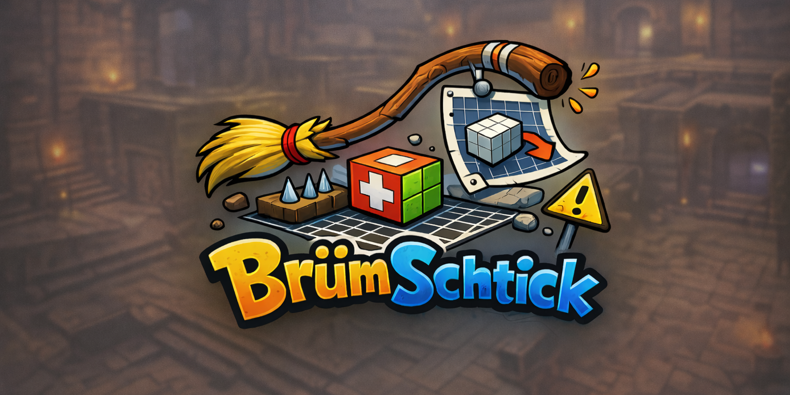

# BrumSchtick 🤪🧱✨

> [!TIP]
> BrumSchtick is the wacky, feature-happy fork of TrenchBroom for Quake-engine map magic. Vibes first, productivity right behind. 🎛️🧙‍♂️

## Quick Vibe Check ✅🎉
- 🎯 Fork of [TrenchBroom](https://github.com/TrenchBroom/TrenchBroom) with extra tools, fixes, and playful polish.
- 🧱 Built for Quake-engine games and modern map-making flow.
- ⚡ Focused on speed, discoverability, and "oops that was awesome" moments.

## Feature Confetti 🎊🛠️
| 🔥 Feature | ✨ What it does |
| --- | --- |
| 🔎 Map search bar | Filters by entity properties or textures, plus "Find Usages in Map." |
| 🧱 Brush Builder | Draw convex 2D shapes and sweep them through multi-step transforms with live previews. |
| 🪜 Draw Shape extras | Stairs and circular stairs with step and spiral controls. |
| 🧭 Face alignment tools | Align, fit, and rotate textures to a chosen edge; hotspot texturing via `.rect`. |
| 🧩 Patch to brush | Convert patch meshes to convex brushes while preserving UVs. |
| 🚀 Quick compile/launch | Toolbar actions with profile dropdowns. |
| ✂️ Edge Tool chamfer | Clip selected edges with distance + segments. |
| 💡 Real-time light preview | Point + surface lights in 3D view. |
| 🧾 Map format fidelity | `patchDef3` support and preserved duplicate keys. |
| 🌍 Localization | 20 bundled languages with auto-fallback to English. |

## Link Portal 🔗🌀
- 🏠 Project home: https://github.com/themuffinator/BrumSchtick
- 🧪 Releases: https://github.com/themuffinator/BrumSchtick/releases
- 🧱 Upstream TrenchBroom: https://github.com/TrenchBroom/TrenchBroom
- 📜 Changes from TrenchBroom: CHANGES_FROM_TRENCHBROOM.md
- 🛠️ Build guide: BUILDING.md
- 📘 Manual: app/resources/documentation/manual/index.md
- 🐛 Issue tracker: https://github.com/themuffinator/BrumSchtick/issues

## Credits 💚🎩
BrumSchtick is based on TrenchBroom by Kristian Duske and contributors. Thanks for the sturdy base! 🙌✨
