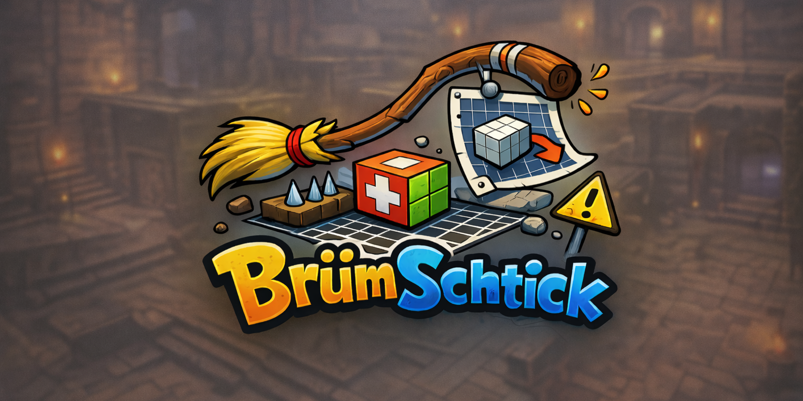

# BrumSchtick 🤪🧱✨

  
  
  
  
  
  

  
  
  
  
  

> [!TIP]
> BrumSchtick is the forever-evolving, feature-happy fork of TrenchBroom focused on faster, easier, and more enjoyable classic idTech mapping workflows.

## Constitution 📜
BrumSchtick direction is formally defined in [CONSTITUTION.md](CONSTITUTION.md).

It clearly states:
- what BrumSchtick is,
- what BrumSchtick is not,
- and the 10 commandments guiding roadmap and implementation decisions.

## Quick Vibe Check ✅
- Fork of [TrenchBroom](https://github.com/TrenchBroom/TrenchBroom) with extra tools, fixes, and compatibility improvements.
- Built for classic idTech-level editing workflows with modern quality-of-life features.
- Focused on unification, utility, speed, and creator-first iteration.

## Feature Confetti 🎊
| Feature | What it does |
| --- | --- |
| Map search bar | Filters by entity properties or textures, plus "Find Usages in Map". |
| Brush Builder | Draw convex 2D shapes and sweep through multi-step transforms with live previews. |
| Draw Shape extras | Stairs and circular stairs with step and spiral controls. |
| Face alignment tools | Align, fit, and rotate textures to a chosen edge; hotspot texturing via `.rect`. |
| Patch to brush | Convert patch meshes to convex brushes while preserving UVs. |
| Quick compile/launch | Toolbar actions with profile dropdowns for faster test loops. |
| Edge Tool chamfer | Clip selected edges with distance and segment controls. |
| Real-time light preview | Point and surface light preview in 3D view. |
| Map format fidelity | `patchDef3` support and preserved duplicate entity keys. |
| Localization | 20 bundled languages with automatic English fallback. |

## Nightly Builds And Updates 🌙🔄
- Nightly tag automation lives in [`.github/workflows/nightly.yml`](.github/workflows/nightly.yml).
- Nightly tags use `vYYYY.N-RCk`, and the nightly workflow builds and publishes cross-platform prerelease assets.
- Nightly releases are published as pre-releases so updater channeling stays clean.
- To receive nightly updates in-app, enable `Include pre-releases` in update preferences.
- Auto-updater behavior and troubleshooting are documented in [AUTO_UPDATER.md](AUTO_UPDATER.md).

## Build From Source 🛠️
Use [BUILDING.md](BUILDING.md) for full setup and platform build instructions.

## Credits 💚
BrumSchtick is based on TrenchBroom by Kristian Duske and contributors.
